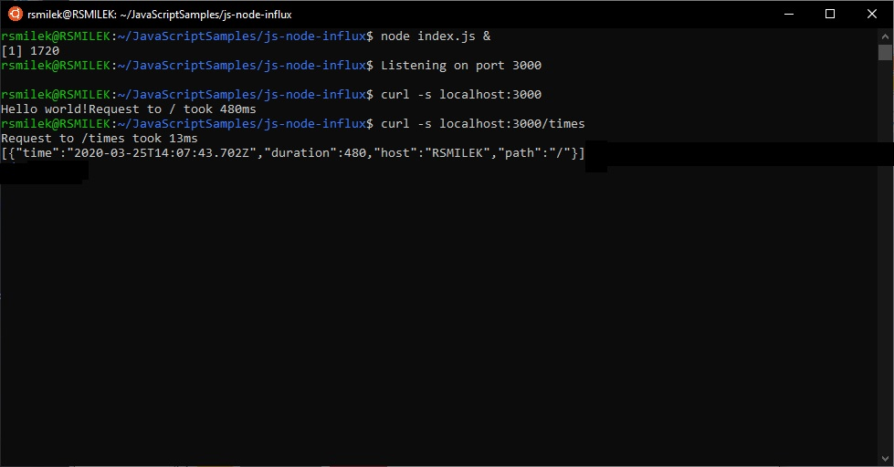

# DESCRIPTION

This project implements simple web server app as introduction to 'node-influx' = The InfluxDB Client for Node.js and Browsers
It's based on [tutorial](https://node-influx.github.io/manual/tutorial.html)

### 'npm install'

Installs the packages app depends on. Requires node.js.

### 'node index.js'

Launches web app.

### 'curl -s localhost:3000'

Returns "Hello world!"

### 'curl -s localhost:3000/times'

Returns json string.

